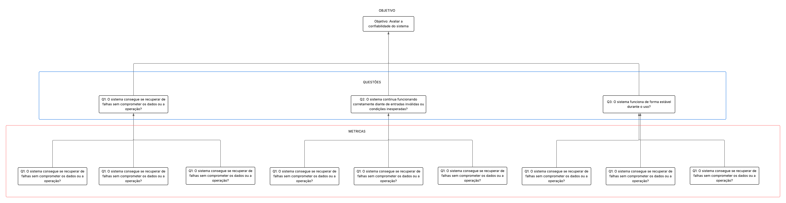
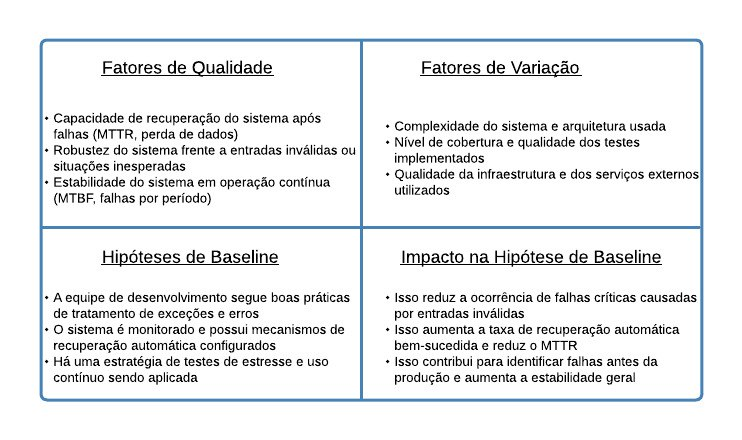

# GQM - Fase de definição

## Confiabilidade

### Objetivo de negócio do AGROMART

O AgroMart tem como objetivo principal ajudar na venda de produtos agroecológicos, criando um elo direto entre os pequenos produtores e os consumidores, tudo isso através das comunidades que apoiam a agricultura (CSA). A ideia é facilitar esse contato e tornar a comercialização mais simples, justa e acessível pra todo mundo.

### Objetivo da Medição

| Analisar           | AGROMART                               |
|--------------------|----------------------------------------|
| Para o propósito de| Entender         |
| Com respeito a     | Confiabilidade                         |
| Do ponto de vista do| Usuário                               |
| No contexto da     | Disciplina de qualidade de software    |

### Questões relacionadas aos objetivos de medição

#### Q1: O sistema consegue se recuperar de falhas sem comprometer os dados ou a operação?

- **Métrica:** Tempo médio para recuperação (MTTR)  
- **Métrica:** Número de falhas com perda de dados  
- **Métrica:** Taxa de recuperação automática bem-sucedida  

#### Q2: O sistema continua funcionando corretamente diante de entradas inválidas ou condições inesperadas?

- **Métrica:** Número de erros tratados com sucesso  
- **Métrica:** Taxa de falhas críticas causadas por entradas incorretas  
- **Métrica:** Resultados de testes de estresse ou entrada inválida  

#### Q3: O sistema funciona de forma estável durante o uso?

- **Métrica:** Número de falhas/crashes por período  
- **Métrica:** Tempo médio entre falhas (MTBF)  
- **Métrica:** Taxa de interrupções não planejadas  

### Fluxograma da relação entre objetivos, questões e métricas

<strong>Figura 1: fluxograma de confiabilidade </strong> 

Fonte: 

### Quadrante de usabilidade

<strong>Figura 1: Quadrante de confibilidade </strong> 

Fonte: Vinicius Mendes 

## 📑 Histórico de Versões

| Versão  |    Data    |       Descrição       |Autor(es)                |
| :-----: | :--------: | :-------------------------:|:----------------------------------: | 
|`1.0` | 19/05/2025 | Criação do quadrante de confiabilidade    | [Vinicius Mendes ](https://github.com/yabamiah)|

