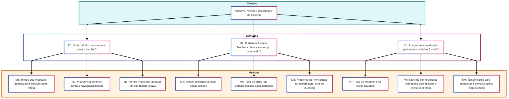
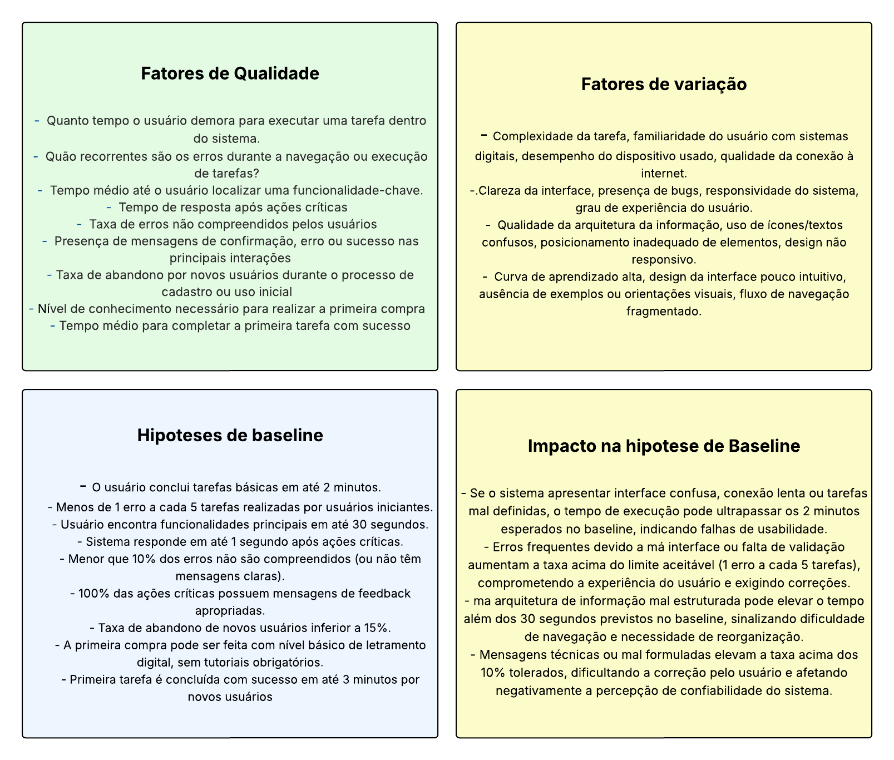

# GQM - Fase de definição

## Usabilidade 

### Objetivo de negócio do AGROMART

O AgroMart tem como objetivo principal ajudar na venda de produtos agroecológicos, criando um elo direto entre os pequenos produtores e os consumidores, tudo isso através das comunidades que apoiam a agricultura (CSA). A ideia é facilitar esse contato e tornar a comercialização mais simples, justa e acessível pra todo mundo.

### Objetivo da Medição

| Analisar           | AGROMART                               |
|--------------------|----------------------------------------|
| Para o propósito de| Entender, controlar e melhorar         |
| Com respeito a     | Usabilidade                            |
| Do ponto de vista do| Usuário                               |
| No contexto da     | Disciplina de qualidade de software    |

### Questões relacionadas aos objetivos de medição

#### Q1: Quão intuitivo o sistema é para o usuário?

- **Métrica:** Quanto tempo o usuário demora para executar uma tarefa dentro do sistema.  
- **Métrica:** Quão recorrentes são os erros durante a navegação ou execução de tarefas?  
- **Métrica:** Tempo médio até o usuário localizar uma funcionalidade-chave.  

#### Q2: O sistema fornece feedback claro e em tempo adequado?

- **Métrica:** Tempo de resposta após ações críticas  
- **Métrica:** Taxa de erros não compreendidos pelos usuários  
- **Métrica:** Presença de mensagens de confirmação, erro ou sucesso nas principais interações  

#### Q3: A curva de aprendizado para novos usuários é curta?

- **Métrica:** Taxa de abandono por novos usuários durante o processo de cadastro ou uso inicial  
- **Métrica:** Nível de conhecimento necessário para realizar a primeira compra  
- **Métrica:** Tempo médio para completar a primeira tarefa com sucesso  

### Fluxograma da relação entre objetivos, questões e métricas

<strong>Figura 1: fluxograma de usabilidade </strong> 

Fonte: Felipe Pedroza 

### Quadrante de usabilidade

<strong>Figura 1: Quadrante de usabilidade </strong> 

Fonte: Mayara Alves 

## 📑 Histórico de Versões

| Versão  |    Data    |       Descrição       |Autor(es)                |
| :-----: | :--------: | :-------------------------:|:----------------------------------: | 
|`1.0` | 19/05/2025 | Criação do quadrante de usabilidade.    | [Mayara Alves](https://github.com/Mayara-tech)|
|`2.0` | 18/05/2025 | Criação do fluxograma de usabilidade.    | [Felipe Pedroza](https://github.com/darkymeubem) |