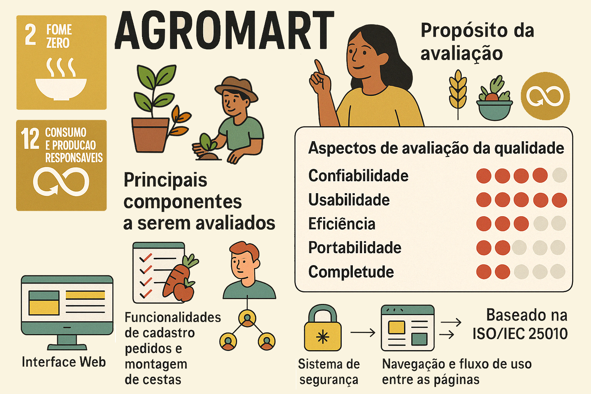

# **Escopo do Trabalho – Avaliação de Qualidade do AgroMart**

## 🎯 Metas da Etapa

1. Selecionar o software a ser avaliado (AgroMart)
2. Descrever o propósito da avaliação
3. Relacionar os objetivos com os ODS (Objetivos de Desenvolvimento Sustentável)
4. Definir os requisitos e critérios de avaliação

## 🖥️ Software Selecionado

- **Nome:** AgroMart (versão Web)
- **Descrição:** Plataforma de apoio à comercialização de cestas de produtos agroecológicos por meio de comunidades que sustentam a agricultura (CSA)
- **Repositório:** [https://github.com/AgroMart](https://github.com/AgroMart)

## 🎯 Propósito da Avaliação

- **Nome do Produto:** AgroMart  
- **Versão:** Considerada como 1.0 (em desenvolvimento)

**Domínio de Aplicação:** Agronegócio, com foco em agricultura familiar e comercialização digital de produtos agroecológicos. Pode incluir e-commerce, gestão de pedidos, controle de estoque e comunidades.

**Objetivos da Avaliação:**

- ✔️ Assegurar a qualidade do produto
- ✔️ Identificar pontos de melhoria
- ❌ Adequar o produto a normas de certificação
- ❌ Comparar com concorrentes
- ❌ Obter laudo técnico
- ❌ Classificação ou premiação
- ❌ Uso em licitações

**Outro objetivo:** Aprimorar usabilidade e confiabilidade, promovendo uma experiência fluida, intuitiva e estável para os usuários. A avaliação também dará suporte para melhorias futuras em eficiência e completude.

## ✅ Aspectos de Qualidade Avaliados

| Característica     | Ênfase (1-5) | Justificativa                                                                 |
|--------------------|--------------|-------------------------------------------------------------------------------|
| **Usabilidade**    | 5            | Clareza de interface, navegabilidade, tempo de aprendizado e acessibilidade. |
| **Confiabilidade** | 4            | Consistência, integridade de dados e tolerância a falhas.                     |
| **Eficiência**     | 2            | Tempo de resposta, leveza e consumo de recursos.                              |
| **Portabilidade**  | 2            | Compatibilidade entre navegadores e dispositivos móveis.                      |
| **Completude**     | 2            | Grau de implementação das funcionalidades previstas.                          |

## 🧩 Descrição Geral do Produto

**Quantidade de Funções da Interface do Usuário: 11**
- Cadastro e login de usuários
- Visualização e busca de lojas (por nome ou região)
- Visualização de produtos e preços
- Contato com a loja
- Realização de pedidos e histórico
- Gerenciamento de planos, endereços e perfil

**Tarefas Principais:**
1. Cadastro de produtores e produtos
2. Montagem e gerenciamento de cestas
3. Processamento de pedidos e entregas
4. Administração das comunidades (CSA)
5. Comunicação entre usuários
6. Geração de relatórios

**Funções Críticas para Avaliação:**
- Cadastro de produtores e produtos
- Montagem de cestas
- Comunicação e notificações
- Gestão de comunidades (CSA)
- Confiabilidade e rastreabilidade

**Janelas de Interação:**
1. Login e Cadastro
2. Dashboard
3. Cadastro de Produtos
4. Montagem de Cestas
5. Gestão de Pedidos
6. Administração das Comunidades (CSA)

## 👤 Usuários e Ambiente

**Usuários principais:**  
Pequenos agricultores, consumidores conscientes e coordenadores de CSA.

**Ambiente de uso:**
- Regiões com acesso tecnológico limitado
- Interface acessível para uso em celulares
- Foco em transparência e confiança
- Promove agricultura familiar e economia solidária

**Conhecimento exigido:**
- **Informática:** Básico para navegação web e apps
- **Domínio da aplicação:** Interface simples, voltada para o público geral

## 🔍 Componentes Avaliados

- Interface Web (layout, fluxo, responsividade)
- Cadastro, pedidos e montagem de cestas
- Módulo de comunidades (CSA)
- Login e segurança básica
- Navegação geral e fluxo entre páginas

## 📊 Dados para Avaliação

- Não há dados reais no repositório.
- Serão usados dados simulados (mock data) com base nas rotas e modelos definidos no sistema.

## ⚙️ Requisitos de Execução

**Hardware:**
- Computador com navegador moderno (Chrome, Firefox, Edge)
- Conexão com internet estável

**Software:**
- Sistema operacional: Windows, Linux ou macOS
- Navegador atualizado (Chrome recomendado)
- Para testes locais: Node.js + npm ou yarn

## 🧭 Categoria do Produto

- **Domínio:** Agronegócio / Agricultura Familiar
- **Modelo de Negócio:** Marketplace agroecológico
- **Características Técnicas:** Web responsiva com foco em acessibilidade
- **Fonte de dados:** Repositório público no GitHub com documentação parcial

## 🌱 ODS Relacionados

- **ODS 2:** Acabar com a fome e promover agricultura sustentável
- **ODS 12:** Assegurar padrões sustentáveis de produção e consumo

## 🧪 Requisitos e Critérios de Avaliação

**Modelo base:** ISO/IEC 25010 adaptado ao contexto da aplicação AgroMart.

### Critérios Adaptados:
- A avaliação será feita apenas na versão Web.
- Interações serão analisadas com base nas experiencias de usuários e protótipos disponíveis.
- Uso de massa de dados simulada para testes.
- Segurança avançada, acessibilidade plena e integração externa serão observadas apenas descritivamente.

## ✅ Imagem descritiva do projeto

> **Nota**: Esse conteúdo foi baseado no esboço desenvolvida pelo Grupo sobre a plataforma AgroMart. [📄 Acesse o documento](../assets/Esboco.pdf)

## 📑 Histórico de Versão

| Versão | Data       | Descrição                                 | Autor                                   |
|--------|------------|-------------------------------------------|------------------------------------------|
| `1.0`  | 13/05/2025 | Criação da página do Projeto| [Mayara A. Oliveira](https://github.com/Mayara-tech) |
| `2.0`  | 13/05/2025 | Criação do projeto | [Felipe Pedroza](https://github.com/darkymeubem), [Fillipe Souto](https://github.com/fillipeb50), [Philipe Barbosa](https://github.com/PhMoraiis), [Mayara Alves](https://github.com/Mayara-tech), [Vinicius Mendes ](https://github.com/yabamiah)      |
